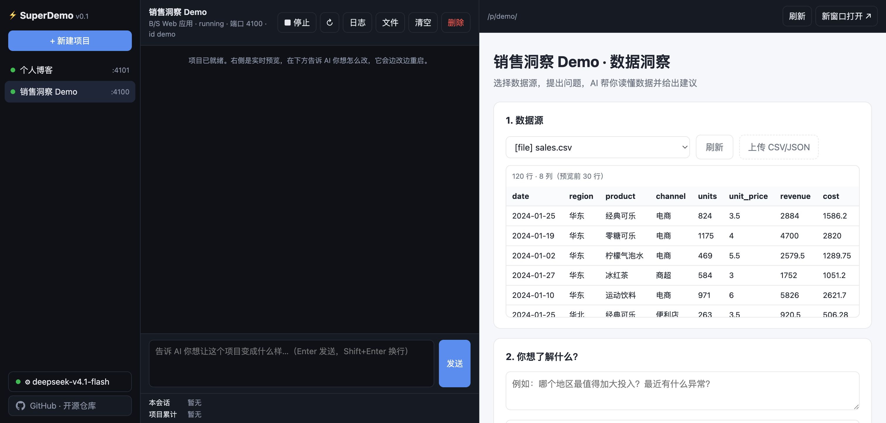

<p align="center">
  <h1 align="center">⚡ SuperDemo 制造器</h1>
  <p align="center">接入任意 OpenAI 兼容大模型，用对话创建、运行并持续改造多个可独立部署的 Demo 项目。<br>
  <b>面向业务人员改「正在运行的系统」，而不是面向开发者产代码。</b></p>
</p>

<p align="center">
  
</p>

## 它是什么

SuperDemo 是一个 **AI agent 壳**：

- 左侧管理多个项目，中间和 AI 对话，右侧是项目的实时预览。
- 告诉 AI「我想要一个 ×× 工具」，它直接改正在运行的项目：写文件 → 自动重启 → 预览刷新，全过程可见（工具调用、模型思考、重启日志）。
- 每个项目都是一个**自包含目录**：`node server.js` 就能独立运行，自带 `Dockerfile`，不依赖壳。
- 项目内置 SDK：HTTP 路由、LLM 调用、**真实数据库（SQLite）**、数据源（文件 / 数据库 / API）、AI 数据洞察。
- 目标用户：小白、初创团队、企业内部——想法验证的第一个可用 Demo，并能逐步演进到可部署系统。

与 Claude Code / Codex 等编码工具的区别：它们产出代码交给开发者部署；SuperDemo 直接运行、直接改、直接给业务人员用。

## 快速开始

需要 **Node.js ≥ 22.13**（使用内置 `node:sqlite`，项目零第三方依赖）。

```bash
git clone https://github.com/QiRanChenk/INeedSuperDemo.git
cd INeedSuperDemo
npm install
npm start          # http://localhost:3000
```

首次打开在左下「模型设置」选择预设、填入 API Key：

| 预设 | Base URL | 默认模型 |
|---|---|---|
| DeepSeek | `https://api.deepseek.com` | `deepseek-chat` |
| 智谱 GLM | `https://open.bigmodel.cn/api/paas/v4` | `glm-5.3-flash` |
| Qwen Coding Plan | `https://token-plan.cn-beijing.maas.aliyuncs.com/compatible-mode/v1` | `qwen3-coder-plus` |
| Qwen DashScope | `https://dashscope.aliyuncs.com/compatible-mode/v1` | `qwen3-coder-plus` |
| Ollama 本地 | `http://127.0.0.1:11434/v1` | 任意 |
| 自定义 | 任何 OpenAI 兼容端点 | — |

也可以复制 `.env.example` 为 `.env` 配置。模型需支持 tool calling。

然后点「新建项目」，在描述里写一句需求，例如：

> 做一个门店库存预警工具：录入商品和库存，低于阈值标红，并让 AI 给补货建议

AI 会在几十秒内把内置模板改成你要的东西。之后继续对话迭代即可。

## 内置样例：数据洞察助手

新建 B/S 项目默认得到一个可用的「数据洞察助手」：

- 选择数据源（内置 120 行销售 CSV、SQLite 数据表、示例公开 API，或上传自己的 CSV/JSON）
- 上传的数据自动导入 SQLite 表；提问 + 勾选建议方向（增长机会 / 风险预警 / 成本优化 / 客户洞察 / 下一步行动）
- AI 基于程序统计出的数据画像（而非原始行）输出阅读友好的 Markdown 结论与建议
- 分析结果持久化到项目数据库，可回看

## 功能一览

- **多项目**：创建 / 启动 / 停止 / 重启 / 删除，每项目独立端口与子进程，壳内通过 `/p/<id>/` 反向代理访问
- **在线热更新**：AI 改完文件自动重启，启动日志回灌给模型自行排错
- **完整过程回放**：对话历史逐条落盘，切换项目再切回，思考过程（reasoning、工具调用、结果、重启记录）完整保留
- **Token 统计**：本会话 / 项目累计的输入、输出、缓存命中率、合计
- **项目内 AI 可独立配置**：默认 Demo 复用壳的模型；取消勾选后可为 Demo 单独指定端点 / 模型 / Key（如 agent 用编码模型、Demo 用便宜的对话模型），保存即自动重启项目生效
- **真实存储**：项目 SDK 提供 `openDb()`（SQLite），Agent 被要求所有持久化数据必须入库
- **独立部署**：项目目录即部署单元，`npm start` 或 `docker build`
- **项目类型**：B/S Web 应用、无界面服务；C/S 桌面应用（规划中）

## 目录结构

```
shell/        壳：Express 服务、项目注册与进程管理、反向代理、agent 循环、Web UI
sdk/          注入到每个项目的零依赖 SDK（http / llm / db / datasource / insights）
templates/    项目模板：web-basic（B/S，内置数据洞察样例）、headless-basic（无界面服务）
projects/     生成的项目（已 gitignore），每个目录 = 一个可独立部署的应用
data/         壳设置（settings.json，已 gitignore，含 API Key）
```

## 项目契约

每个项目目录包含：

- `project.json`：id / name / type / entry / port / autoStart
- 入口 `server.js` 监听 `process.env.PORT`
- LLM 配置通过环境变量 `SUPERDEMO_LLM_BASE_URL / SUPERDEMO_LLM_API_KEY / SUPERDEMO_LLM_MODEL` 注入（独立部署时写 `.env`）
- 前端使用相对 URL，既能在壳的子路径下运行，也能独立在根路径运行
- `sdk/` 由壳维护，项目启动时自动同步最新版本

SDK API 详见 [`sdk/README.md`](sdk/README.md)。

## 路线图

- [x] B/S 项目、无界面服务、壳内运行、自动重启热更新、Dockerfile
- [x] SQLite 真实存储、数据源统一契约（文件 / 数据库 / API）
- [x] 思考过程持久化回放、Token 统计、启动/停止
- [ ] C/S 桌面项目模板（Electron / Tauri）
- [ ] 项目间协作（服务发现 + 壳内 HTTP 网关）
- [ ] 一键导出 zip / 构建 Docker 镜像
- [ ] Postgres / MySQL 数据源
- [ ] 多用户与权限

## 许可证

[MIT](LICENSE)
