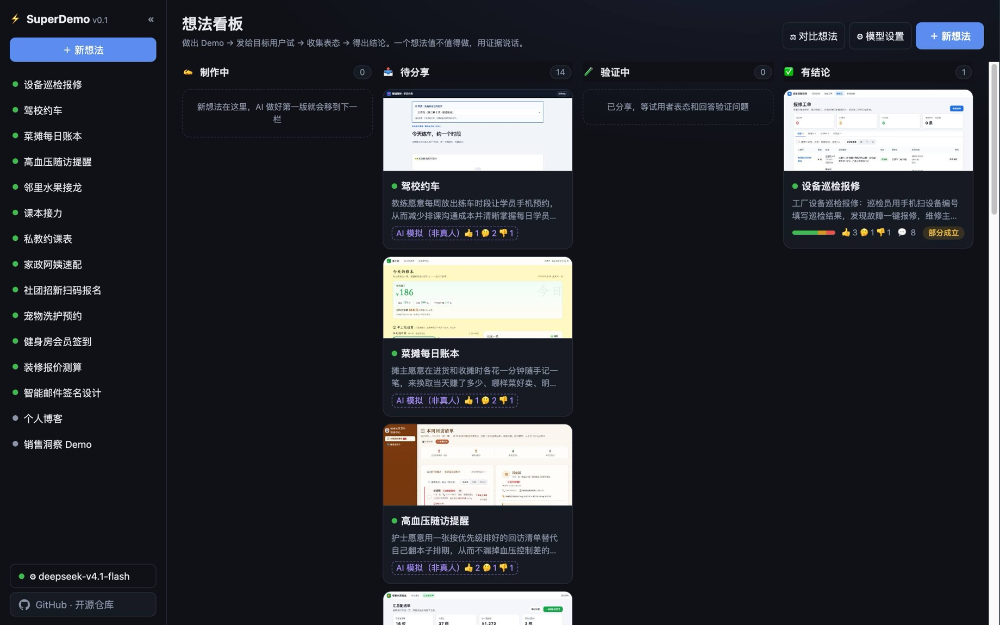

<p align="center">
  <h1 align="center">⚡ SuperDemo</h1>
  <p align="center">一句话想法 → 几分钟做出能点的 Demo → 发给目标用户试 → 用证据判断值不值得做。<br>
  <b>接入任意 OpenAI 兼容大模型的「想法验证器」。</b></p>
</p>

<p align="center">
  
</p>

## 它是什么

做一个想法之前，最贵的是「做完才发现没人要」。SuperDemo 把验证这一步压到最短：

1. **写一句想法**，AI 出一份验证方案：要验证的假设、怎样算成立、问试用者的问题、核心场景（1–2 页），以及 2–3 个按行业和使用场景推导的设计方向，每个方向都能先**画出草图**对比。
2. **AI 照着方案和草图做出 Demo**（真实页面、真实数据库、能走通核心流程），在电脑和手机两种尺寸下自查。
3. **AI 模拟试用**：4 位不同态度的模拟用户先自动走一遍核心流程，指出看不懂、不可信、按钮坏了的地方，一键改好。
4. **分享给真实的目标用户**：每个人群一条链接，附带可直接发微信的邀请话术；访客可以一键表态、回答验证问题、留下联系方式，或报告「有地方坏了」。
5. **用证据下结论**：AI 综合**行为**（谁真的动手提交过、看了多久、录入了什么）和**表态**给出「假设成立 / 部分成立 / 不成立 / 样本不足」，对照事先定的成立标准，附证据、顾虑和下一步；按结论改一版就开始下一轮验证，和上一轮对比。
6. 同时验证多个想法时，**对比视图**按证据强弱排序，告诉你哪个最值得继续。

不想一步步来？「⚡ 一键到底」从方案、草图、制作、模拟试用到按意见修改全自动完成（约 12–18 分钟）。

它不追求做成能落地的系统；但每个 Demo 都是一个**自包含目录**（`node server.js` 即可运行，自带 Dockerfile），想法验证通过后可以接着演进。

## 快速开始

需要 **Node.js ≥ 22.13**（使用内置 `node:sqlite`）。

```bash
git clone https://github.com/QiRanChenk/INeedSuperDemo.git
cd INeedSuperDemo
npm install
npm start          # http://localhost:3000（Demo 预览与分享链接在 3001，见「访问安全」）
```

首次打开会先请你在「模型设置」里选择预设、填入 API Key，然后点「＋ 新想法」，写一句话或点一个示例：

> 菜市场摊主用手机随手记每天进货和卖出，收摊后看今天赚了多少、明天该少进什么

| 预设 | Base URL |
|---|---|
| DeepSeek | `https://api.deepseek.com` |
| 智谱 GLM | `https://open.bigmodel.cn/api/paas/v4` |
| Qwen Coding Plan | `https://token-plan.cn-beijing.maas.aliyuncs.com/compatible-mode/v1` |
| Qwen DashScope | `https://dashscope.aliyuncs.com/compatible-mode/v1` |
| Ollama 本地 | `http://127.0.0.1:11434/v1` |
| 自定义 | 任何支持 tool calling 的 OpenAI 兼容端点 |

**模型建议**（同一个想法在同一网关上的实测）：能关闭「深度思考」的模型最合适——deepseek-v4-pro 成品最好（制作约 10 分钟），deepseek-v4.1-flash 最快；只能开着思考的模型（如 GLM 5.x）出方案和制作会慢 2–3 倍，也画不了草图。

## 验证闭环

| 环节 | 你看到的 | 说明 |
|---|---|---|
| 方案 | 假设 · 成立标准 · 验证问题 · 设计方向 + 草图 | 关掉也会存草稿；确认后 AI 按方案和选中的草图制作 |
| 制作 | 预览区先显示目标草图，做完换成真实页面 | 收尾前自检：电脑 + 手机各看一次、清理没用上的骨架页、「点了没反应」的按钮必须修 |
| 模拟试用 | 4 位模拟用户的第一反应、对验证问题的回答、分享前建议先改 | 不算真实证据，单独展示 |
| 分享 | 链接 + 邀请话术 + 访客导览卡 | 首次分享自动把当前数据存为演示数据，每晚 4 点恢复；「打开看看」以访客视角预览，不计入统计 |
| 收集 | 表态、回答、留言、联系方式、🐞 报错；访问、真动手、停留时长、录入内容 | 访客的报错与对想法的评价分开统计；新反馈可推送到企业微信 / 飞书 / 钉钉群，每晚 9 点推送当日小结 |
| 结论 | 成立 / 部分成立 / 不成立 / 样本不足 + 证据 + 下一步 | 行为比表态更可信；不足 5 人会提示再找几个人；按链接对比不同人群 |
| 下一轮 | 「按真人结论改一版」 | 开新一轮验证，证据只算本轮，结论与上一轮对比 |

## 访问安全

SuperDemo 可以让 AI 在本机执行命令，因此：

- 默认只监听 `127.0.0.1`。要让局域网 / 公网访问，必须同时设置访问口令，否则拒绝启动：
  ```bash
  HOST=0.0.0.0 SUPERDEMO_PASSWORD='一个足够长的随机口令' npm start   # 浏览器弹出登录框，用户名随意
  ```
- **Demo 运行在独立的源上**：预览和分享链接由第二个端口提供（默认主端口 + 1，可用 `SUPERDEMO_DEMO_PORT` 指定），Demo 页面里的任何脚本都碰不到 SuperDemo 的页面、凭据和接口；AI 查看和操作页面通过注入到 Demo 里的脚本 + `postMessage` 完成，每个项目有自己的预览密钥。SuperDemo 拒绝浏览器标记为非同源的写请求。
- 分享链接的访客匿名、无需口令，只能使用那一个 Demo；他们提交的内容里不能带网页代码（防止存储型 XSS），反馈有频率限制，留言交给 AI 时只作为数据、不作为指令。
- 访客留下的联系方式只在 SuperDemo 里可见，不会发给模型，也不会推送到群里。

## 部署到服务器 / NAS

```bash
cp .env.example .env    # 填 SUPERDEMO_PASSWORD（必填）；可选 HOST_PORT（默认 18788）、DEMO_HOST_PORT（默认 18789）
docker compose up -d --build
```

需要对外开放**两个端口**：SuperDemo（18788）和 Demo（18789）。通过域名 / 反向代理访问时：

1. 给两个端口各配一个地址，例如 `https://demo.example.com:8788 → 18788`、`https://demo.example.com:8789 → 18789`。
2. 在「模型设置」里填 **Demo 地址**（如 `https://demo.example.com:8789`）。不填时 SuperDemo 会自动尝试「当前端口 + 1」，找到后通过域名访问时会自动记住。
3. 可选：填 **SuperDemo 的公网地址**（群推送里的「查看」链接用）和 **新反馈推送到群** 的机器人地址。

Demo 端口不可达时，预览会退回和 SuperDemo 同源（预览地址旁标「⚠ 同源预览」），功能照常但不再隔离。

`data/`（设置与 Key）和 `projects/`（项目、数据库、会话、版本）挂载在宿主机。`deploy/fnos-deploy.py` 是一键部署到飞牛 fnOS 的脚本：本机构建对应架构的镜像后传过去，依赖不变时只同步代码并重启。

## 制作能力

- **方案先行 + 设计方向**：先出可编辑的方案；2–3 个设计方向（设计语言、布局、行业专属元素）可各画一张高保真草图对比，手机优先的方向按手机尺寸画
- **AI 看得见、点得动页面**：`page_view` 看实际效果（页面结构 + 自动布局检查：横向溢出、遮挡、截断、低对比度、图片失败；支持图片的模型附带截图），`page_act` 像用户一样点击、填表、提交并跟随跳转；点击后页面毫无变化会被标出来。页面由你打开的 SuperDemo 标签页代为渲染，服务器无需浏览器
- **统一组件库**：项目 SDK 自带 `_sd/sd.css` + `_sd/sd.js`（6 种设计语言、布局原型、表单、弹窗、手机端自动变卡片的表格、无依赖图表等）
- **在线热更新 + 版本回滚**：改完文件自动重启，启动日志和前端报错回灌给模型；每轮对话前自动存版本，一键撤销
- **随时停止 / 插话 / 排队**，多会话，上下文自动瘦身，Token 统计
- **独立部署**：项目目录即部署单元，可导出 zip 或构建 Docker 镜像（不含 API Key）
- 「⚙ 模型设置 → 显示技术细节」可以打开端口、Token、启停按钮、运行日志等开发者信息（默认隐藏）

## 目录结构

```
shell/        SuperDemo：Express 服务、项目进程管理、反向代理（含 Demo 独立源）、agent 循环、验证闭环、Web UI
sdk/          注入到每个项目的零依赖 SDK（http / llm / db / datasource / insights / ui 组件库）
templates/    起步骨架：管理后台、表单收集与审批、数据看板、数据洞察、空白页、无界面服务
projects/     生成的项目（已 gitignore），每个目录 = 一个可独立部署的应用
data/         设置（含 API Key）、访问日志、密钥等（已 gitignore）
test/         node --test；e2e-pagebot 用本机 Chrome 无头跑一遍跨源页面操作（没有 Chrome 时跳过）
```

## 项目契约

- `project.json`：id / name / type / entry / port / autoStart
- 入口 `server.js` 监听 `process.env.PORT`；LLM 配置通过 `SUPERDEMO_LLM_BASE_URL / SUPERDEMO_LLM_API_KEY / SUPERDEMO_LLM_MODEL` 注入
- 前端使用相对 URL，既能在 `/p/<id>/`、`/s/<token>/` 子路径下运行，也能独立在根路径运行
- `sdk/` 由 SuperDemo 维护，项目启动时自动同步；运行时数据放 `data/`（含 SQLite），版本回滚不会触碰
- 支持 WebSocket（代理转发 upgrade 请求）

SDK API 详见 [`sdk/README.md`](sdk/README.md)。

## 路线图

- [x] 想法验证闭环：方案 → 草图 → 制作 → 模拟试用 → 分享 → 行为 + 表态证据 → 结论 → 下一轮
- [x] 多想法对比、群机器人推送与每日小结
- [x] Demo 独立源隔离、访客输入筛查
- [x] docker-compose 部署、导出 zip / Docker 镜像
- [ ] 跨想法的用户访谈记录（线下访谈也作为证据）
- [ ] C/S 桌面项目模板
- [ ] 多用户与权限

## 许可证

[MIT](LICENSE)
